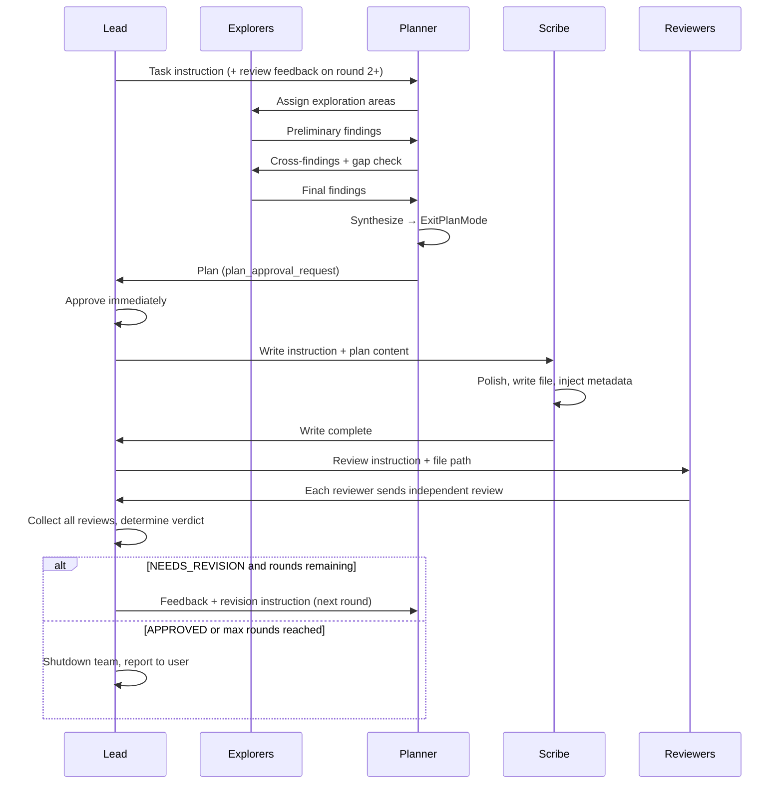

# Damascus v4 — Agent Teams

## Goal

Replace sequential subagent workflow with Agent Teams: parallel explorers investigate different codebase areas, a single planner synthesizes findings, a scribe handles all document writes, and reviewers judge independently. Teammates stay alive across rounds, eliminating the need for agent resume.

## Tech Stack

- **Orchestration**: Claude Code Agent Teams API (TeamCreate, SendMessage, TaskCreate) — because it provides built-in team lifecycle, inter-agent messaging, and shared task list
- **External reviews**: Existing `scripts/gemini-review.ts` and `scripts/openai-review.ts` — because they already support dry-run/mock modes and are proven in v3
- **Document writing**: Scribe teammate with Write tool — because Lead should orchestrate, not write

## Architectural Decisions

### Team Composition

- **Lead**: Orchestrator only. Does not write documents or review. Manages rounds, relays instructions, determines verdict.
- **Explorers (N)**: Each investigates an assigned codebase area. Report findings to the single Planner. N determined by Lead based on task complexity.
  — because parallel exploration covers more ground faster than a single agent scanning everything.
- **Planner (1)**: Manages all explorers, synthesizes their findings, creates the final plan via ExitPlanMode. Always single instance.
  — because multiple planners cause DONE-sync failures (planner sends DONE, receives new message, reactivates with conflicting plans).
- **Reviewers (up to 3, independent)**:
  - Reviewer-Claude: Pure Claude review based on codebase analysis
  - Reviewer-Gemini: Runs `gemini-review.ts` via Bash, sends result to Lead
  - Reviewer-OpenAI: Runs `openai-review.ts` via Bash, sends result to Lead
  — because Gemini/OpenAI are script-based API calls, not Claude agents. Each reviewer sends their review independently to Lead, who determines the verdict.
- **Scribe (1)**: Editor + recorder. Writes the document with quality polish, manages `.review.md`, records round history.
  — because separating writing from planning prevents file conflicts and gives the document a consistent voice.

### Round Flow

- Explorers explore → Planner synthesizes → Scribe writes → Reviewers review → loop or end.
- Each phase completes fully before the next begins. No cross-phase parallelism.
  — because the document must be saved before review, and review must complete before revision. The parallelism is within each phase (explorers explore in parallel, reviewers review in parallel).

### Explorer–Planner Coordination

- Planner assigns each Explorer a domain area (e.g., architecture, data flow, error handling).
- Explorers report preliminary findings to Planner. Planner shares cross-findings and identifies gaps.
- Explorers report final findings. Planner synthesizes all findings into a unified plan via ExitPlanMode.
  — because the single Planner has full context of all findings and can produce a coherent plan without DONE-sync issues.

### Reviewer Independence

- Each reviewer (Claude, Gemini, OpenAI) reviews independently and sends their review to Lead.
- Lead collects all reviews and determines the verdict: any CRITICAL issue → NEEDS_REVISION, otherwise → APPROVED.
  — because independent reviews prevent groupthink and Lead has the full picture to make a fair judgment.

### Scribe Responsibilities

- **Write**: Receive draft from Lead, polish structure/consistency/formatting, save with Write tool.
- **Metadata**: Run `plan-metadata.sh` to inject timestamps and session ID.
- **Review file**: Write `.review.md` with consolidated reviewer feedback. Compress previous rounds into history table.
- **Round log**: Record each round's key decisions and changes for context preservation.
  — because centralizing all writes in one agent prevents file conflicts and maintains document consistency across rounds.

### Command Structure

- New command `/forge-team` alongside existing `/forge`, `/forge-plan`, `/forge-doc`.
- Existing commands remain unchanged (v3 sequential workflow).
- `/forge-team` accepts same arguments: `[-n max] [-o path] <task>`.
- Plan/doc mode distinction maintained: planners adopt different perspectives based on mode.
  — because existing workflow is proven and should not break. Users choose team mode explicitly.

### Team Sizing

- Lead determines Explorer count based on task complexity. Planner is always 1.
- Reviewer count is up to 3 (Claude, Gemini, OpenAI) based on enabled reviewers in settings. Disabled reviewers are not spawned.
- Scribe is always 1.
  — because the user shouldn't need to understand internal team structure.

## Constraints

- Lead must NOT write documents — orchestration only. Lead DOES determine the review verdict.
- Scribe must be the only agent that uses Write tool on the target document and .review.md.
- Planner must NOT edit files directly — submits plan via ExitPlanMode to Lead.
- Explorers report findings to Planner only, not to Lead directly.
- Each round phase (explore/plan/write/review) must complete before the next begins.
- Reviewers review independently — each sends review to Lead, who collects and determines verdict.
- External review scripts must respect `DAMASCUS_DRY_RUN` and `DAMASCUS_MOCK_RESPONSE_FILE` for testing.
- Agent Teams requires `CLAUDE_CODE_EXPERIMENTAL_AGENT_TEAMS=1` in settings.

## Scope

**In scope (v4.0)**:
- Team creation and lifecycle (spawn, rounds, shutdown)
- Round-based draft → write → review → revise flow
- Explorer-to-planner communication via SendMessage
- Scribe document writing, metadata injection, review file management
- `/forge-team` command
- Dry-run/mock mode compatibility for testing

**Out of scope**:
- Replacing existing `/forge` commands (v3 workflow preserved)
- Custom reviewer roles beyond Claude/Gemini/OpenAI
- Mid-session dynamic team scaling
- Cross-document forging (multiple documents in one session)
- Review history persistence across sessions

## v4 이후 검토 방향 (확정 아님)

- 기존 `/forge` 커맨드의 team 모드 통합
- 사용자 지정 reviewer 역할 추가
- 라운드 중 사용자 개입 (토의 방향 조정)
- 세션 간 리뷰 히스토리 연속성
- 추가 LLM provider 통합
