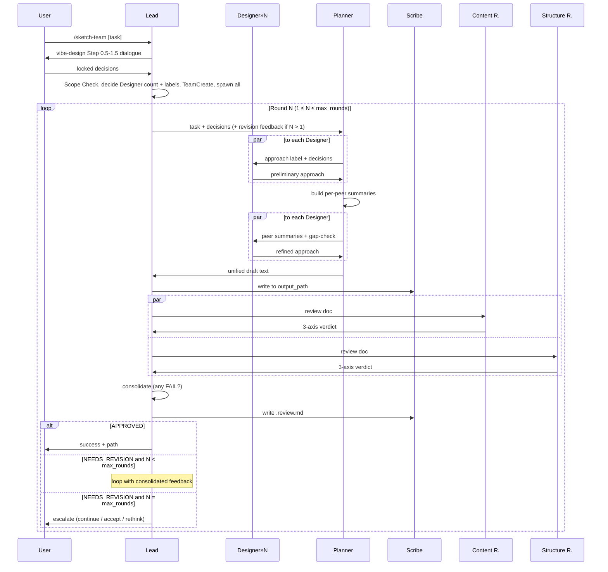

# /sketch-team — Agent Teams design + review workflow

## Goal
Bundle vibe-design + design-review into one Agent Teams workflow that explores multiple design approaches in parallel, synthesizes them, and runs a review-revise loop until approved — in a single invocation.

## Tech Stack
- Orchestration: Claude Code Agent Teams (`TeamCreate`, `Agent`, `SendMessage`) — because the pattern is already proven in damascus v3→v4 migration
- Required setting: `CLAUDE_CODE_EXPERIMENTAL_AGENT_TEAMS=1` in `.claude/settings.json`
- Optional setting: `teammateMode: "tmux"` for split-pane teammate visibility — because it lets the user observe progress; not required for functionality
- Per-role models: hardcoded in SKILL.md (Designer: sonnet, Planner: sonnet, Scribe: haiku, Reviewers: haiku) — because no settings file in v0; fixed assignments cover the mechanical nature of rubric + writing tasks

## Architectural Decisions

- **Hybrid interaction model** — Lead conducts user dialogue (vibe-design Step 0.5–1.5); team runs the parallel-explore + synthesize + review-revise loop autonomously after handoff. Because: vibe-design's core principle is "AI cannot guess user-only decisions" (UX flow, business rules, scope). Fully autonomous would violate this. Post-dialogue the remaining decisions are AI-judgment-OK, so the team can run autonomously.

- **Six-member team** (Lead + Designer × 1–3 + Planner + Scribe + Content Reviewer + Structure Reviewer). Because: each cognitive mode gets its own role — Lead (orchestration), Designer (approach exploration), Planner (synthesis), Scribe (writing), Reviewer (evaluation). Single-writer pattern prevents file conflicts and keeps role boundaries clean.

- **Parallel Designer approach exploration** — Designers work in parallel, each on a distinct approach to the same task. Because: design is trade-off exploration, not area partitioning. Multiple parallel approaches + cross-pollination surfaces more trade-offs than single-agent sequential exploration. Validated by damascus v3→v4 migration experience — the agent-teams gain is real.

- **Lead decides Designer count (1–3) at setup** — based on the trade-off space surfaced during Q&A. Because: Lead has full dialogue context. When trade-offs are contested (e.g., two plausible tech stacks), spawn 2–3 Designers; simple design with one obvious path → 1 Designer. Ceiling of 3 caps overhead on complex designs.

- **Two-pass Designer iteration (preliminary → cross-pollinate → refined)** — Designers submit preliminary approaches; Planner shares peer summaries + gap-check prompts; Designers submit refined approaches. Because: damascus pattern. Lets each Designer strengthen or adjust their approach in light of peers without losing independent perspective. Single-pass loses this signal.

- **Planner synthesizes, does not write** — Planner consolidates refined approaches into a unified draft text and returns to Lead. Lead forwards to Scribe for the write. Because: clean role separation. Planner stays in "cognitive synthesis" mode; Scribe handles mechanical writing. Mixing both within one agent causes mode-switching friction across rounds.

- **Scribe is the single writer** — writes `[design].md` and `[design].review.md`. Because: damascus pattern. Single writer prevents file conflicts, keeps Lead / Planner / Reviewers focused on their cognitive roles, gives consistent formatting.

- **Strict rubric verdict with max_rounds cap** — any FAIL → NEEDS_REVISION; loop terminates at `max_rounds` (default 3). Because: design-review's "any FAIL caps grade at C" is intended discipline, not a limitation. Threshold-based verdicts erode vibe-coding rigor. The cap encodes the anti-patterns.md insight that persistent FAILs across rounds indicate a fundamentally wrong design — more rounds won't fix it.

- **Inline handoff via SendMessage** — Lead packages locked decisions into Planner's initial prompt; no intermediate handoff file. Because: damascus pattern. Only `[design].md` and `[design].review.md` are real artifacts; intermediate state stays in-memory, cleanup stays trivial.

- **Always write `.review.md`** — Scribe writes `[design].review.md` every round with per-round verdict + axis results. Because: audit value; first-round APPROVED still benefits from a "passed cleanly" record.

- **Escalate on max_rounds exhaustion** — when the cap is reached with FAILs remaining, Lead reports current state to user with three explicit options (continue / accept-as-is / rethink design). Because: vibe-design philosophy — the system should not auto-decide on user-judgment territory. anti-patterns.md teaches that persistent FAILs need human reframing, not more iteration.

## Constraints

- Must: Lead conducts vibe-design Step 0.5–1.5 (target doc confirmation + dialogue) and the Scope Check **before** TeamCreate — if "설계 불필요", exit without spawning the team.
- Must: Lead's initial Planner message contains (1) structured "Confirmed Decisions" list, (2) "Open Decisions" list (what Planner/Designers may decide autonomously), (3) Designer count decision, (4) approach labels for each Designer.
- Must: Designer approach labels are distinct (no two Designers assigned the same label in one round).
- Must: Cross-pollination happens before refined approaches — Planner distributes each Designer a summary of peer approaches plus a gap-check prompt after preliminary reports.
- Must: Planner returns only draft text to Lead — never writes files, never sends files paths.
- Must: Scribe is the only agent holding the Write tool.
- Must: All teammate-to-Lead messages use `recipient: "team-lead"` (Agent Teams convention).
- Must: Reviewers evaluate the written design doc file — not the in-flight draft text.
- Must not: Spawn more than 3 Designers in any single round.
- Must not: Lead skip dialogue on a one-liner input — at least 1–2 clarifying questions required.
- Must not: Lead auto-escalate if any step stalls — if stuck, ask the user.
- Must not: Reviewers modify the design doc (read-only tool access).
- Must not: Add a settings file (`.claude/sketch-team.local.md`) — `-n` flag is the only configuration surface for v0.
- Must not: Re-enter `/sketch-team` automatically after escalation — user must explicitly re-invoke if they choose "continue".

## Scope

**In scope (v0)**:
- `/sketch-team [task description]` command with `-n max_rounds` (default 3) and `-o output_path` flags
- Six-role team with Lead-decided Designer count (1–3)
- Two-pass Designer exploration with Planner cross-pollination
- Strict 6-axis verdict; escalate on max_rounds exhaustion
- `[design].review.md` artifact written every round
- README + docs documenting required `.claude/settings.json` entry

**Out of scope (deferred to v0 이후 검토 방향)**:
- Settings file for max_rounds default / model overrides / Designer count override
- Per-axis reviewer mode
- Multi-document design in one workflow
- Round resume on partial failure
- Custom rubric injection
- User checkpoint before each round

## Agent Roles

| Role | Tools | Responsibility |
|---|---|---|
| **Lead** | Orchestration only | Conducts vibe-design Step 0.5–1.5 dialogue, decides Designer count and approach labels from Q&A trade-off space, spawns team, sends task + revision feedback to Planner, collects Reviewer verdicts, consolidates, terminates. Never writes files. Never judges design content. |
| **Designer × 1–3** | Read / Glob / Grep | Receives approach label + decisions from Planner. Produces preliminary approach → receives peer summaries + gap-check from Planner → produces refined approach. Returns text only; never writes files. |
| **Planner** | Read / Glob / Grep | Coordinates Designers: assigns initial task per approach label, collects preliminary approaches, cross-pollinates (peer summaries + gap-check prompts), collects refined approaches, synthesizes into a unified draft text, sends to Lead. Never writes files. |
| **Scribe** | Write / Read | Receives draft from Lead → writes design doc to resolved output path. Receives consolidated review from Lead → writes `.review.md` (with round-history table if N > 1). Only agent touching files. |
| **Content Reviewer** | Read | Evaluates 3 axes: Decision Purity, Rationale Presence, Decision Maturity. Returns PASS/WARN/FAIL per axis + actionable comments to Lead. |
| **Structure Reviewer** | Read | Evaluates 3 axes: Context Budget, Constraint Quality, CLAUDE.md Alignment. Same return format. |

## Round Flow

## v0 이후 검토 방향 (확정 아님 — v0 사용 경험 후 결정)

- Settings file (`.claude/sketch-team.local.md`) for max_rounds default / model overrides / Designer count override
- Per-axis reviewer mode (6 reviewers)
- Multi-document handoff (one round → multiple linked docs)
- Round resume on partial failure
- Custom rubric injection (user-supplied axes)
- Round-level user checkpoint ("approve this round before next?")
- Designer failure mitigation (if two Designers converge to identical approach)
