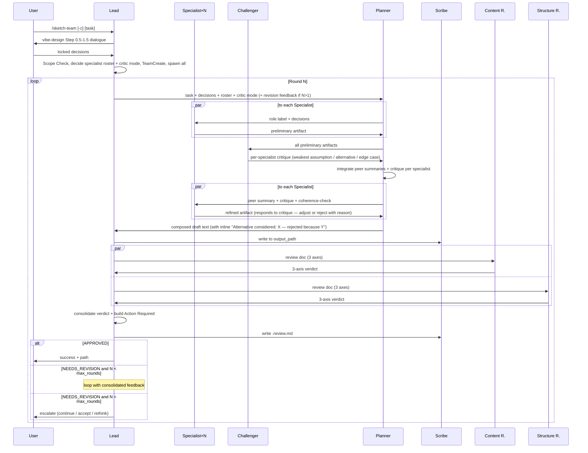

# /sketch-team — Agent Teams concrete-design + review workflow

## Goal
Produce a **concrete, multi-domain design document** by combining specialist Designers, cross-domain synthesis, and a 6-axis review loop into a single Agent Teams workflow. Where `/sketch` (vibe-design alone) keeps decisions abstract so AI can fill in implementation later, `/sketch-team` deliberately concretises the design — interfaces, data shapes, sequence diagrams, error patterns — because in some domains the concrete artifact *is* the decision.

## Tech Stack
- Orchestration: Claude Code Agent Teams (`TeamCreate`, `Agent`, `SendMessage`) — because the pattern is proven in damascus v3→v4
- Required setting: `CLAUDE_CODE_EXPERIMENTAL_AGENT_TEAMS=1` in `.claude/settings.json`
- Optional setting: `teammateMode: "tmux"` for split-pane teammate visibility — because it lets the user observe progress; not required for functionality
- Per-role models: hardcoded in SKILL.md (Specialist Designer: sonnet, Planner: sonnet, Scribe: haiku, Reviewers: haiku) — because no settings file in v0; specialists need depth, mechanical roles can use cheaper models

## Architectural Decisions

- **Positioning vs `/sketch`** — `/sketch` is "decisions only, no implementation" (vibe-design philosophy). `/sketch-team` is "decisions + concrete artifacts that pin them down". Use `/sketch-team` when the concretion itself is the decision (API contracts, message protocols, data models with cascading type implications); use `/sketch` for early-stage thinking where leaving implementation open is the right call. Because: heavy machinery (5+ agents, review loop) only justifies itself if the output is fundamentally different — not just "the same vibe-design done in parallel".

- **Hybrid interaction model** — Lead conducts user dialogue (vibe-design Step 0.5–1.5) before team spawn; team runs concretization + cross-domain coherence + review-revise loop autonomously. Because: vibe-design's principle "AI cannot guess user-only decisions" still holds. Post-dialogue decisions are AI-judgment-OK, so the team runs autonomously.

- **Specialist Designers, Lead-decided per task** — Lead identifies the relevant specialist roles (e.g., `data-model`, `api-surface`, `protocol`, `error-handling`, `operations`, `auth-and-trust`) from the task and locked decisions, then assigns one Designer per specialist (1–3 specialists). Because: agent-teams' real value comes from each Designer bringing *expert depth in one domain*, not from running parallel "approaches" to the same problem. A data-model specialist produces concrete schemas; an api-surface specialist produces concrete endpoint contracts. Synthesis = composition, not selection.

- **Seven-member default team** (Lead + Specialist Designer × 1–3 + **Challenger × 1** + Planner + Scribe + Content Reviewer + Structure Reviewer). With the `-c` flag, Challengers scale to **one per Specialist** (8–10 members total). Because: each cognitive mode gets its own role — Lead (orchestration), Specialists (domain depth), Challenger (adversarial critique of Specialist assumptions), Planner (cross-domain synthesis), Scribe (writing), Reviewer (rubric evaluation). Single-writer pattern prevents file conflicts.

- **Challenger role — adversarial review during design, not after** — reads every preliminary Specialist artifact and produces a reasoned counter-argument for each one (weakest assumption; alternative framing; missed edge case). Delivered to Planner, who integrates critique with peer summaries into one coherence-check message per Specialist. Refined artifacts must respond to the challenge either by adjusting or by stating why the challenge is rejected. Because: Specialists can be locally correct AND collectively wrong — they might agree on a shared faulty premise. Reviewers catch rubric violations post-hoc but not premise-level mistakes. A dedicated Challenger during the design phase surfaces blind spots before writing.

- **Challenger scope — Open Decisions only** — Challenger may attack choices in the Open Decisions territory (implementation approach, library selection, internal structure) but **MUST NOT** challenge Confirmed Decisions (came from user dialogue). If a Confirmed Decision looks suspect, Challenger surfaces it to Planner as "open question for user" rather than self-overriding it. Because: vibe-design's core principle "AI cannot guess user-only decisions" applies to Challenger too.

- **Per-Specialist critic mode (`-c` flag)** — spawns one Challenger per Specialist (same count as Specialists). Each Challenger is paired with one Specialist and focuses adversarial attention on that domain only. Default (no flag) uses a single Challenger that reads all Specialists and produces cross-cutting critiques. Because: for high-stakes designs, paired critics give deeper per-domain adversarial scrutiny; for most designs, a single Challenger catches enough blind spots at a fraction of the cost.

- **Alternatives surface inline in the final doc** — whenever Challenger raises a viable alternative that was considered and rejected, the decision appears in the draft as `Alternative considered: X — rejected because Y`. Because: design docs that record only the chosen decision hide the reasoning from future readers; future engineers encountering "why did you not do X?" should find the rejection rationale already answered.

- **Two-pass specialist iteration with challenge integration**: preliminary → **Challenger reads + produces critique** → Planner integrates peer summary + critique into coherence-check → Specialists refine → compose. Because: cross-domain consistency (from peer summaries) and premise correctness (from Challenger) are two different failure modes. Merging both into one coherence-check message lets Specialists respond to the whole picture in a single refinement.

- **Planner = cross-domain synthesizer, does not write** — Planner composes specialist outputs into one unified draft text; resolves cross-domain conflicts using the locked Confirmed Decisions; sends to Lead. Lead forwards to Scribe. Because: clean role separation — synthesis (cognitive) vs writing (mechanical) shouldn't mix in one agent.

- **Scribe is the single writer** — writes `[design].md` and `[design].review.md`. Because: damascus pattern; single writer = no file conflicts; consistent formatting.

- **Concretion-friendly 6-axis rubric (replaces vibe-design's anti-pseudocode rubric)**:
  1. **Specification Productivity** — concrete artifacts (signatures, schemas, sequence diagrams) must be **load-bearing**: they pin down a decision that prose alone can't. Decorative pseudocode (translating English into code-shaped text without adding decision content) → FAIL.
  2. **Rationale Presence** — every decision and every concrete spec choice has a `because …` clause.
  3. **Decision Maturity** — confirmed decisions and candidate items are clearly separated; candidates have no rationale.
  4. **Specialist Coherence** — domain artifacts compose without contradiction (e.g., the data model's `id: UUID` and the API spec's `id: integer` is FAIL).
  5. **Constraint Quality** — constraints express boundaries (must / must not), not implementation noise. Concrete spec is allowed when it *is* the constraint (e.g., "must accept ISO-8601 UTC timestamps").
  6. **CLAUDE.md Alignment** — design doc is referenced from CLAUDE.md, not duplicated.
  
  Because: vibe-design's "Decision Purity" axis is anti-concrete — it would reject the very output we want sketch-team to produce. Replacing it with **Specification Productivity** keeps the discipline (no decorative pseudocode) while allowing load-bearing concrete artifacts. **Specialist Coherence** replaces vibe-design's "Context Budget" because the new failure mode in concrete multi-domain design is cross-domain contradiction, not length.

- **Strict rubric verdict with max_rounds cap** — any axis FAIL → NEEDS_REVISION; cap at `max_rounds` (default 3); escalate to user if cap hit. Because: same anti-patterns.md insight — persistent FAILs indicate fundamentally wrong design, not insufficient iteration.

- **Length budget loosened** — core doc target ~400–600 lines (vs vibe-design's 200–300). Deeper details go in reference files. Because: concrete artifacts (data models, sequence diagrams, API spec tables) take more lines than abstract decisions, and that overhead is the value.

- **Inline handoff via SendMessage** — Lead packages locked decisions into Planner's initial prompt; no intermediate handoff file. Same as v1.

- **Always write `.review.md`** — Scribe writes `[design].review.md` every round with per-round verdict + axis results + Lead's action-required summary. Same as v1.

- **Escalate on max_rounds exhaustion** — Lead reports current state to user with three options (continue / accept / rethink). Same as v1.

## Constraints

- Must: Lead conducts vibe-design Step 0.5–1.5 dialogue + Scope Check **before** TeamCreate.
- Must: Lead's initial Planner message includes (1) Confirmed Decisions, (2) Open Decisions, (3) specialist roster (with role labels), (4) target document path, (5) critic-mode flag (single vs per-specialist).
- Must: Each Specialist's role label is distinct in a single round.
- Must: Coherence-check message Planner sends each Specialist integrates peer summary AND Challenger critique — do not send them separately.
- Must: Planner returns only draft text to Lead — never writes files.
- Must: Scribe is the only agent holding the Write tool.
- Must: Reviewers evaluate the written design doc file (not in-flight draft text).
- Must: Concrete artifacts in the design doc must each carry a brief `because …` rationale (Specification Productivity axis).
- Must: When Challenger's alternative is rejected, record it inline as `Alternative considered: X — rejected because Y` next to the winning decision.
- Must not: Spawn more than 3 Specialists in one round.
- Must not: Challenger attack Confirmed Decisions — those came from user dialogue and are non-negotiable. Surface concerns to Planner as "open question for user" instead.
- Must not: Lead skip dialogue on a one-liner input — at least 1–2 clarifying questions required.
- Must not: Reviewers modify the design doc.
- Must not: Add a settings file (`.local.md`) for v0 — `-n` and `-c` flags are the only configuration surface.
- Must not: Use `/sketch-team` for tasks where vibe-design's Scope Check returns "설계 불필요" — exit before TeamCreate.

## Scope

**In scope (v0)**:
- `/sketch-team [task]` with `-n max_rounds` (default 3), `-o output_path`, and `-c` (per-specialist critics) flags
- 7-role default team; 8–10-role team under `-c`
- Challenger adversarial critique during design (not only post-hoc review)
- Two-pass specialist iteration with cross-domain coherence check + critique integration
- Concretion-friendly 6-axis rubric (replaces vibe-design's anti-pseudocode rubric)
- Inline `Alternative considered: X — rejected because Y` entries next to challenged decisions
- `[design].review.md` every round
- README + docs documenting required `.claude/settings.json`

**Out of scope (deferred to v0 이후 검토 방향)**:
- Settings file for max_rounds default / model overrides / specialist roster override
- Per-axis reviewer mode
- Multi-document design (one workflow → multiple linked docs)
- Round resume on partial failure
- Custom rubric injection
- Specialist library (predefined roster for common task types)
- Challenger can override Confirmed Decisions (currently forbidden — would require a different dialogue-escalation protocol)

## Agent Roles

| Role | Tools | Responsibility |
|---|---|---|
| **Lead** | Orchestration only | Conducts vibe-design Step 0.5–1.5 dialogue, decides specialist count + role labels + critic mode (single / per-specialist with `-c`), spawns team, sends task + revision feedback to Planner, collects Reviewer verdicts, consolidates verdict + builds Action Required summary, terminates. Never writes files. Never judges design content. |
| **Specialist Designer × 1–3** | Read / Glob / Grep | Receives one specialist role label + decision sheet. Produces preliminary domain artifact (schemas / API contracts / sequence diagrams / error patterns / etc.) with rationale per spec choice. Receives integrated peer summaries + challenger critique from Planner. Produces refined artifact that responds to critique. Returns text only. |
| **Challenger × 1 (default) or × N (`-c`)** | Read / Glob / Grep | Reads Specialist preliminary artifacts (all of them in default mode; one in paired-critic mode). Produces adversarial critique per Specialist: (1) weakest assumption, (2) alternative framing, (3) missed edge case. Scope limited to Open Decisions — may NOT attack Confirmed Decisions. Sends critique to Planner for integration. Returns text only. |
| **Planner** | Read / Glob / Grep | Coordinates Specialists + Challenger: assigns initial roles, collects preliminary artifacts, relays artifacts to Challenger, collects critiques, integrates peer summaries + critique into a single coherence-check message per Specialist, collects refined artifacts, composes into a unified draft (records Challenger-rejected alternatives inline; uses Confirmed Decisions as tiebreaker for cross-domain conflicts), sends to Lead. Never writes files. |
| **Scribe** | Write / Read | Writes design doc + `.review.md`. Only file-writer on the team. |
| **Content Reviewer** | Read | 3 axes: Specification Productivity, Rationale Presence, Decision Maturity. |
| **Structure Reviewer** | Read | 3 axes: Specialist Coherence, Constraint Quality, CLAUDE.md Alignment. |

## Round Flow



## Output Template

The design document follows this structure (sections marked `[optional]` only included when relevant to the task):

```markdown
# [Feature / System Name]

## Goal
One sentence describing what this design delivers.

## Tech Stack
- [Component]: [tech] — because [why]

## Architectural Decisions
- **[Decision]**: [what] — because [why]

## Constraints
- Must: [hard requirement]
- Must not: [prohibited approach]

## Scope
**In scope**: …
**Out of scope**: …

## Data Models  [optional — included if data-model specialist participated]
Concrete schemas with types where types matter for compatibility / cascading decisions.

## Interfaces / API Surface  [optional — included if api-surface specialist participated]
Endpoint contracts, message formats, function signatures where the contract is the decision.

## Sequence Diagrams  [optional — included if protocol / multi-agent specialist participated]
Mermaid sequence / state diagrams for cross-component flows.

## Error Patterns  [optional — included if error-handling specialist participated]
Failure modes + recovery decisions (not exhaustive impl details).

## Operational Concerns  [optional — included if operations specialist participated]
Deployment, observability, rollback decisions.

## v0 이후 검토 방향
Candidate items (no rationale).
```

Specialists drive which optional sections appear — Planner doesn't add sections speculatively.

## v0 이후 검토 방향 (확정 아님 — v0 사용 경험 후 결정)

- Settings file (`.claude/sketch-team.local.md`) for max_rounds default / model overrides / specialist roster override
- Predefined specialist library for common task types (web-service, multi-agent system, CLI, etc.)
- Per-axis reviewer mode
- Multi-document handoff (one round → multiple linked docs)
- Round resume on partial failure
- Custom rubric injection
- Round-level user checkpoint
